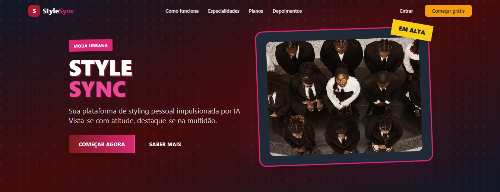
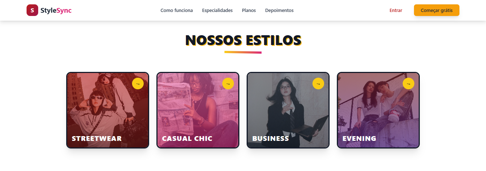

# StyleSync - Landing Page

<div align="center">


[](https://erikalaiane.github.io/stylesync-landing/)

**Seu stylist pessoal, sempre disponível ✨**

Landing page moderna e elegante para plataforma de consultoria de moda personalizada

</div>

---

## Sobre o Projeto

**StyleSync** é uma landing page desenvolvida para uma plataforma de consultoria de moda personalizada. O projeto apresenta um design sofisticado com paleta de cores vinho e dourado, criando uma experiência visual elegante e envolvente.

### Características Principais

- Design elegante com paleta vinho e dourado
- Totalmente responsivo para todos os dispositivos
- Performance otimizada com Vite
- Animações e transições suaves
- Arquitetura componentizada com React
- SEO Friendly

---

## Tecnologias Utilizadas

- **[React](https://react.dev/)** `18.3.1` - Biblioteca JavaScript para construção de interfaces
- **[Vite](https://vitejs.dev/)** `5.4.10` - Build tool moderna e extremamente rápida
- **[Tailwind CSS](https://tailwindcss.com/)** `3.4.15` - Framework CSS utility-first para estilização rápida
- **[ESLint](https://eslint.org/)** - Linter para manter código limpo e padronizado
- **[PostCSS](https://postcss.org/)** - Ferramenta para transformar CSS
- **[Autoprefixer](https://github.com/postcss/autoprefixer)** - Adiciona prefixos de fornecedores automaticamente

---

## Preview

<div align="center">

### Desktop View




**[🚀 Ver Demo ao Vivo](https://erikalaiane.github.io/stylesync-landing/)**

</div>

---

## Como Rodar o Projeto

### Pré-requisitos

- Node.js (versão 18 ou superior)
- npm ou yarn

### Instalação

1. **Clone o repositório**

```bash
git clone https://github.com/erikalaiane/stylesync-landing.git
```

2. **Entre no diretório do projeto**

```bash
cd stylesync-landing
```

3. **Instale as dependências**

```bash
npm install
```

4. **Inicie o servidor de desenvolvimento**

```bash
npm run dev
```

5. **Abra no navegador**

Acesse [http://localhost:5173](http://localhost:5173)

---

## Scripts Disponíveis

```bash
npm run dev      # Inicia servidor de desenvolvimento
npm run build    # Cria build de produção
npm run preview  # Preview da build de produção
npm run lint     # Executa o linter
npm run deploy   # Faz deploy para GitHub Pages
```

---

## Estrutura do Projeto

```
stylesync-landing/
├── public/
│   └── images/          # Imagens do site
├── src/
│   ├── components/      # Componentes React
│   │   ├── Header.jsx
│   │   ├── Hero.jsx
│   │   ├── HowItWorks.jsx
│   │   ├── Expertise.jsx
│   │   ├── Featured.jsx
│   │   ├── WhyStyleSync.jsx
│   │   ├── Pricing.jsx
│   │   ├── Testimonials.jsx
│   │   ├── Team.jsx
│   │   ├── Newsletter.jsx
│   │   └── Footer.jsx
│   ├── App.jsx          # Componente principal
│   ├── main.jsx         # Ponto de entrada
│   └── index.css        # Estilos globais
├── index.html
├── package.json
├── tailwind.config.js  # Configuração do Tailwind
└── vite.config.js      # Configuração do Vite
```

---

## Paleta de Cores

```css
/* Vinho */
--primary: #8B1538
--primary-dark: #6B0F2A
--primary-light: #B91D47

/* Dourado */
--accent: #D4AF37
--accent-light: #F4D03F
--accent-dark: #B8941F

/* Secundário */
--secondary: #2D1B2E
--secondary-light: #4A2F4D

/* Pop */
--pop: #E91E63
--pop-light: #F48FB1
```

---

## Funcionalidades

- Header fixo com efeito de scroll
- Hero section com gradiente e animações
- Seção "Como Funciona" com cards interativos
- Grid de especialidades com hover effects
- Banner de promoção destacado
- Cards de benefícios
- Tabela de preços comparativa
- Depoimentos de clientes
- Newsletter com formulário
- Footer completo com links e redes sociais
- Menu mobile responsivo
- Animações e transições suaves

---

## Responsividade

O projeto é totalmente responsivo e testado em:

- Mobile (320px - 767px)
- Tablet (768px - 1023px)
- Desktop (1024px+)
- Large Desktop (1440px+)

---

## Contribuindo

Contribuições são sempre bem-vindas! Para contribuir:

1. Faça um fork do projeto
2. Crie uma branch para sua feature (`git checkout -b feature/MinhaFeature`)
3. Commit suas mudanças (`git commit -m 'Adiciona nova feature'`)
4. Push para a branch (`git push origin feature/MinhaFeature`)
5. Abra um Pull Request

---

## Autora

**Erika Laiane**

[](https://github.com/erikalaiane)
[](https://www.linkedin.com/in/erika-laiane-azevedo)
[](mailto:erikalaianeazevedosantos@gmail.com)

---

<div align="center">

Desenvolvido com 💜 por Erika Laiane

</div>